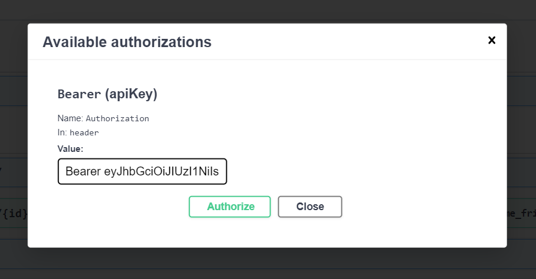
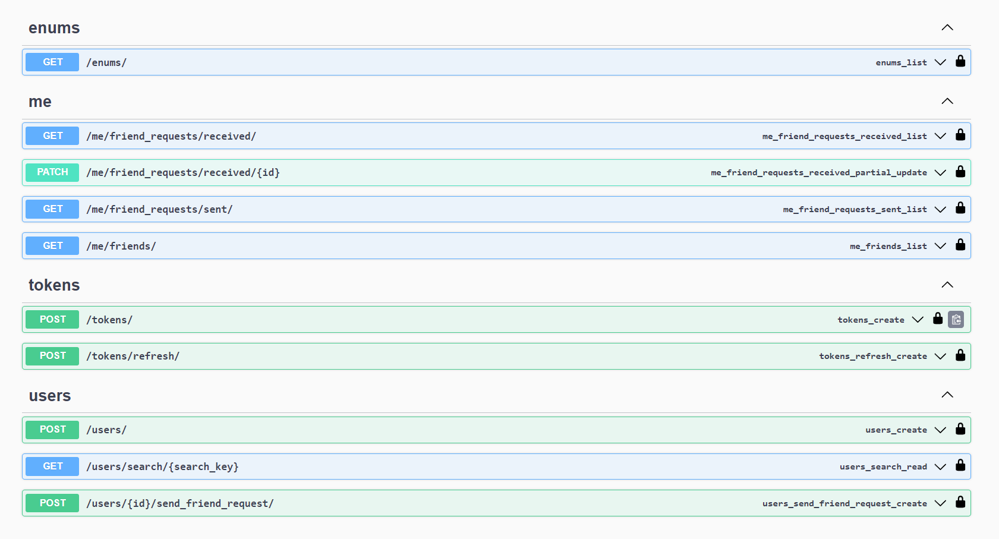

# Setup Steps
## Run without docker
1. Recommended Python Version: 3.11.4
2. Create virtual environment
    - for linux
        ```
        python3 -m venv env
        source ./env/bin/activate
        ```
    - for windows
        ```
        python -m venv env
        cd env/Scripts
        activate
        ```
3. Install requirements
    ```
    pip install -r requirements.txt
    ```
4. Create .env file using .env.example
5. Run migration
    ```
    python3 manage.py migrate
    ```
6. Run collectstatic for admin
```
python3 manage.py collectstatic
```
7. Run server
    - for development
        ```
        python3 manage.py runserver
        ```
    - for production
        ```
        uvicorn --host 0.0.0.0 --port 8000 social_network.asgi:application
        ```

## Run using Docker
```
docker-compose up
```
The server will run on port 8000

# API documentation
Postman collection is stored in `social-network.postman_collection.json`

When server is running, swaager and redoc are available as below:
- Swgger is available at [http://localhost:8000/swagger](http://localhost:8000/swagger) endpoint 
- Redoc is available at [http://localhost:8000/redoc](http://localhost:8000/redoc) endpoint 


## Swagger Bearer API Authentication



## Swagger UI
